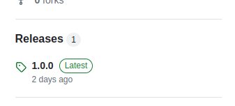
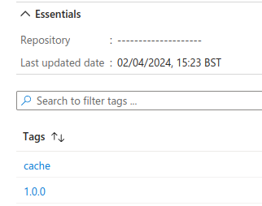
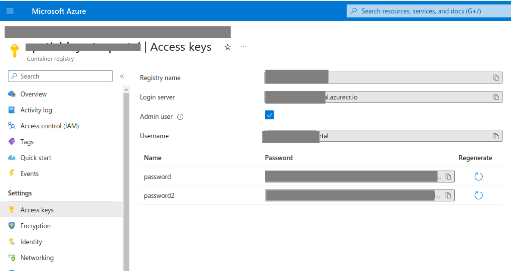

# Github Actions Docker Build Template
This is a template repository set up with the github actions that push a docker image to the github container registry every time the release is published
on the repo.

The name of newly built and published docker image is the same as the name of the repository and the tag is inherited from the release `tag_name`.

  

## Requirements
Three secrets are required to be set in the repository settings either on organization level or on the repository level. In case of repository level where secrets are managed via environments, uncomment the `environment` block in the workflow file.

| Secret Name | Description |
| ----------- | ----------- |
| DOCKER_LOGIN_SERVER | The server URL of the docker registry.|
| DOCKER_USERNAME | The username to login to the docker registry.|
| DOCKER_PASSWORD | The password to login to the docker registry.|

### Azure Container Registry example

For the ACR, you can get the secrets by clicking on the `Access keys` in the ACR settings.

